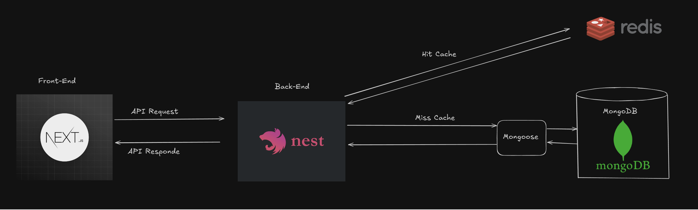

# PersonalWallet

## Demo

[Video Demo (Youtube)](https://youtu.be/ufERrcpZfPk)

## System Architecture

## Er Diagram

`
Table users {
id varchar [primary key]
email varchar
password varchar
username varchar
firstName varchar
lastName varchar
roles Role
}

Table wallets {
id varchar [primary key]
ownerId varchar [ref: > users.id]
name varchar
description varchar
type varchar
}

Table transactions {
id varchar [primary key]
walletId varchar [ref: > wallets.id]
coinName CoinType
amount float
description varchar
type TransactionType
}

Enum CoinType {
"THB"
"USD"
}

Enum Role {
"Customer"
"Admin"
}

enum TransactionType {
"Withdraw"
"Deposit"
}
`
